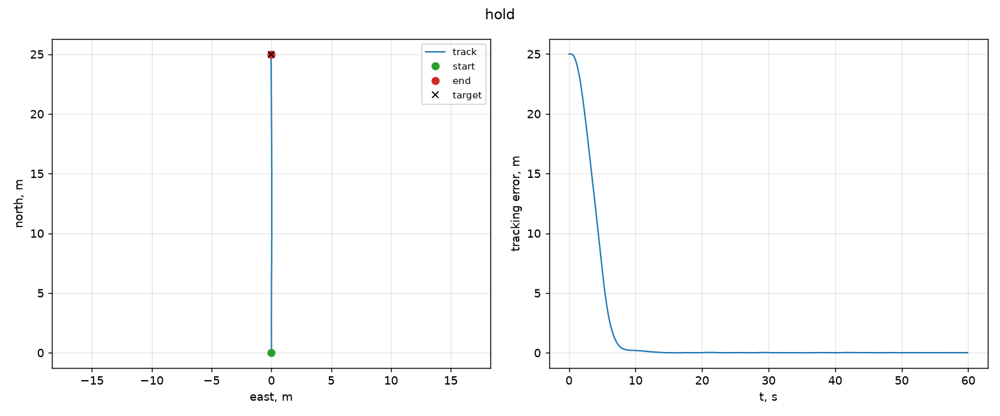
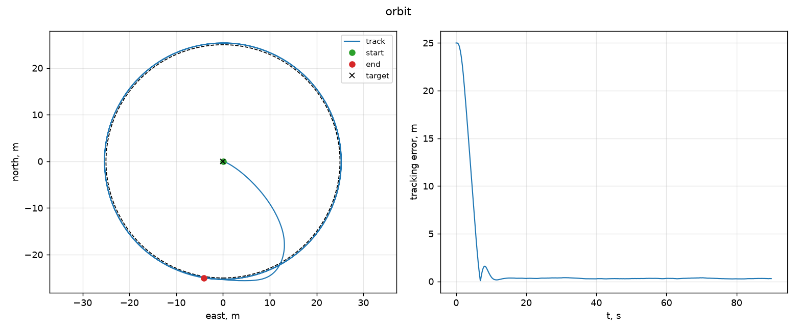
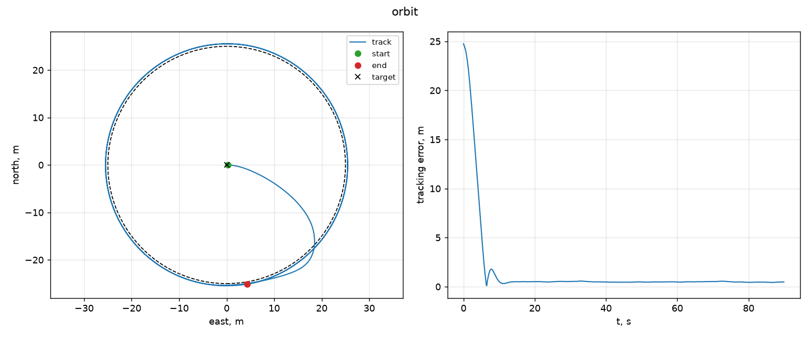
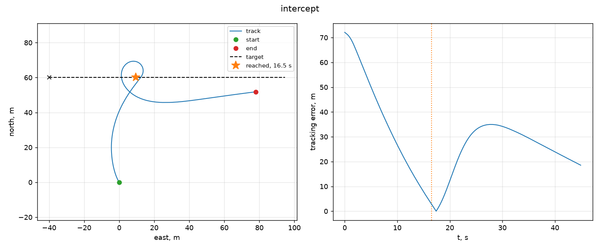
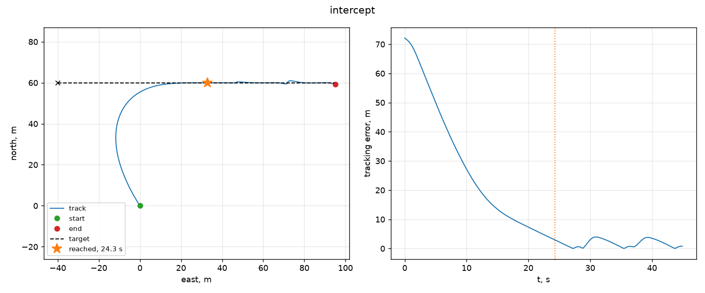

# carrot-guide — наведення дрона на симуляторі

Закони наведення для мультикоптера — утримання точки, обліт кола та перехоплення рухомої
цілі. Дрон літає в ArduPilot SITL, команди — через MAVLink, цикл керування 10 Гц. Тільки
симулятор, без заліза. Технічне завдання — [SPEC.md](SPEC.md).

## Запуск

```bash
make venv          # віртуальне середовище та залежності
make test          # 158 тестів без симулятора, ~1.6 с
make sitl-up       # збірка й запуск ArduCopter SITL у Docker (перша збірка ~15 хв)
make hold          # злетіти, дійти до точки, утримувати 60 с при вітрі
make orbit         # обліт кола радіусом 25 м
make intercept     # перехоплення цілі, що йде своїм курсом
make test-sitl     # інтеграційні тести на симуляторі
make check         # швидкі тести, потім симулятор та інтеграційні
make measure       # усі вимірювання з цього файлу
make plots         # графіки з логів
make sitl-down     # зупинити симулятор
```

Кожен польотний запуск пише CSV-лог у `logs/`; усі числа нижче лежать у
[docs/measurements](docs/measurements) і відтворюються одним `make measure`. Готового
образу SITL немає, тому він збирається з джерел ArduPilot на тезі `Copter-4.5.7` — перша
збірка ~15 хвилин, далі з кешу Docker.

## Модулі

Код поділено на рівні абстракції, і ввід-вивід лишається на найнижчому: із сокетом
працює лише `link.py`, а все, що над ним, має справу зі звичайними значеннями. Тому вся
математика й весь цикл керування тестуються без симулятора

| Пакет / модуль | Що робить |
|---|---|
| `state.py` | стан апарата, локальна система координат NED, проєкція WGS84 ↔ NED |
| `guidance/` | закони наведення: чиста математика, жодного вводу-виводу. Спільна основа — `values`, `vectors`, `target`, `closing`; самі закони — `hold`, `orbit`, `pursuit`, `pronav` |
| `telemetry/` | `modes` — словник протоколу MAVLink, `tracker` — потік повідомлень → типізований стан |
| `link.py` | єдиний модуль, що працює із сокетом: команди, підтвердження, параметри |
| `runner/` | `scheduler` — цикл із фіксованим періодом, `flight` — прогін одного закону, `protocols` — те, що цикл вимагає з обох боків, `stats` — зібрана статистика |
| `mission/` | `vehicle`, `bringup` — зліт і посадка, `reaction` — вимірювання затримки |
| `utils/` | загальне, не пов'язане з польотом: `deadline` — відлік часу, `percentiles`, `text` — парсери CSV, `command` — база підкоманди argparse, `emit` — вивід JSON |
| `metrics/`, `recording/`, `plots.py` | метрики (`events`, `summary`, `latency`), лог (`sample`, `sinks`), графіки |
| `commands/` | підкоманди CLI; `cli.py` лишається модулем — це вхідна точка консольного скрипта |

## Закони наведення

Усі чотири видають вектор швидкості в локальній системі NED; внутрішній контур швидкості
замикає автопілот

**Утримання точки** — пропорційно-диференціальний контур: `kp` тягне до цілі, `kd`
гасить швидкість підходу.

**Обліт кола** — сума тангенційної складової, яка несе апарат по колу, і радіальної, яка
тримає відстань до центру. Ціль виноситься вперед на `lookahead_s` = 0.22 с: це виміряна
затримка реакції цього зв'язку. Винесена вперед точка
прицілювання в законах переслідування зветься carrot — звідси назва проєкту.

**Переслідування** — найпростіший закон для рухомої цілі: вектор швидкості весь час
спрямований у ту точку, де ціль зараз. Апарат іде слідом, а не навперейми, тому на
перехресних курсах виписує криву погоні.

**Пропорційна навігація** — класичне `a = N · Vc · Ω`. Якщо пеленг на ціль не
обертається, курс уже веде на зіткнення, тому закон гасить обертання лінії візування, а
не відстань до цілі. Команда тут — швидкість, тож потрібну кутову швидкість `N · Ω`
задають зсувом курсу на `N · Ω · response_s`. На відміну від `lookahead_s`, це число
підібране, а не виміряне

## Вимірювання

Хост: MacBook (arm64), симулятор у Docker, `SITL_SPEEDUP=1`, home — Київ. Вітер виставляє
сам прогін через параметри симулятора (`SIM_WIND_SPD`, `SIM_WIND_DIR`, `SIM_WIND_TURB`).
Похибка міряється на ділянці утримання: статистика починається через 8 с після виходу на
точку, інакше в середнє потрапляє хвіст підходу. У кожному підсумку вказано вікно
(`window`): `hold`, `post-settle` або `whole run`.

### Утримання точки

Ціль — 25 м на північ, висота 15 м, 60 с.

| | без вітру | 6 м/с | 6 м/с + пориви | 15 м/с + сильні пориви |
|---|---|---|---|---|
| середня похибка | 0.010 м | 0.010 м | 0.010 м | **0.099 м** |
| RMS | 0.011 м | 0.011 м | 0.012 м | 0.115 м |
| 95-й процентиль | 0.017 м | 0.017 м | 0.021 м | 0.206 м |
| максимум | 0.020 м | 0.020 м | 0.028 м | 0.298 м |
| час виходу на точку | 6.4 с | 6.4 с | 6.4 с | 7.1 с |

Перші три колонки однакові: контур швидкості автопілота компенсує стале навантаження
нахилом, і до зовнішнього контуру доходить лише залишок. На десятихвилинному прогоні
(6 м/с із поривами) середня похибка 0.011 м — те саме, що на шістдесяти секундах.



### Обліт кола

Радіус 25 м, тангенційна швидкість 4 м/с, висота 20 м, 90 с, вітер 6 м/с із
турбулентністю. Похибка — відхилення від заданого радіуса.

| | тангенс на поточну точку | з передбаченням 0.22 с |
|---|---|---|
| середнє відхилення радіуса | 0.492 м | **0.311 м** |
| RMS | 0.493 м | 0.312 м |
| 95-й процентиль | 0.543 м | 0.368 м |
| вихід на коло | 5.9 с | 6.3 с |

Без передбачення похибка постійна й однобока — коло завжди ширше заданого, бо тангенс,
порахований для поточної позиції, застаріває за час реакції апарата. Передбачення
прибирає 37% похибки; решта лишається, і на усталеному режимі жоден відлік не потрапляє
всередину кола.





### Перехоплення

Єдиний експеримент із рухомою ціллю. Апарат стартує з точки зльоту, ціль на той момент
за 72 м від нього (60 м на північ, 40 на захід) і йде на схід зі швидкістю 3 м/с. Апарат
тримає 4 м/с, висота 20 м, прогін 45 с, без вітру.

Апарат швидший за ціль, тож зустріч можлива, і найраніший її час дає сама геометрія —
тут 15.06 с. З ним і порівнюють обидва закони. Вихід на ціль — момент, коли відстань
уперше падає нижче 3 м.

| | переслідування | пропорційна навігація |
|---|---|---|
| вихід на ціль | 24.3 с | **16.5 с** |
| від геометричного мінімуму | 1.61 | **1.10** |
| промах | 0.023 м | 0.013 м |
| відстань наприкінці прогону | 0.8 м | 18.5 м |

Пропорційна навігація виходить на ціль за 16.5 с — лише на 10% довше за геометричний
мінімум, і це попри розгін із висіння. Переслідування витрачає 24.3 с: воно цілиться
туди, де ціль зараз, тому довертає протягом усього польоту й лишає собі довшу дугу.

Після зближення закони поводяться по-різному. Переслідування просто йде поруч і
закінчує прогін за 0.8 м від цілі. Пропорційна навігація проходить крізь точку зустрічі
на повній швидкості, виписує петлю й розвертається назад — на графіку видно, як похибка
виростає до 35 м і знову спадає. Це закон зближення, а не супроводу.

`response_s` = 0.66 с — час, за який апарат відпрацює заданий зсув курсу. Спершу сюди
поставили 0.22 с із вимірювання затримки «команда → реакція», але та затримка показує,
коли апарат зрушив, а не коли набрав швидкість: 63% заданої він набирає аж за 1.4 с.
Перебір на симуляторі дав: 0.22 с — 1.50 від мінімуму, 0.66 — 1.10, 1.00 — 1.08,
1.40 — 1.06. Крива вирівнюється приблизно від 0.7 с, і 0.66 стоїть на її початку.





### Частота циклу

Десятихвилинний прогін, 6 000 тактів.

| | значення |
|---|---|
| задана частота | 10 Гц |
| фактична середня | 10.0000 Гц |
| jitter періоду (σ) | 0.136 мс |
| запізнення, 95-й процентиль | 0.002 мс |
| запізнення, максимум | 4.5 мс |
| ресинхронізацій / втрачених тактів | 0 / 0 |

Дедлайни абсолютні (`origin + index * period`), а останню частину періоду цикл не спить,
а крутиться в очікуванні. Скільки саме — міряє `measure_sleep_overshoot` на старті, бо
`sleep` будить потік пізніше, ніж просили: без цього кожен такт запізнювався на ~10 мс.
Наскільки пізніше — залежить і від довжини сну, і від хоста, тому це не константа: на
прогонах у [docs/measurements](docs/measurements) вийшло від 8.4 до 15.9 мс, і ніколи не
більше 20% періоду. Останній рядок таблиці не можна пропускати: ресинхронізація
перебазовує дедлайн, тому зрив показує нуль запізнення, і побачити його можна лише за
лічильником.

### Затримка «команда → реакція»

Час від надсилання цільової швидкості до моменту, коли телеметрія показує 10% від
заданої (крок 3 м/с, 6 спроб, осі по черзі).

| | значення |
|---|---|
| медіана | 222 мс |
| мінімум | 168 мс |
| максимум | 486 мс |

Величина наскрізна — канал, цикл автопілота, інерція апарата, телеметрія 20 Гц, — тому
це оцінка того, наскільки застарілі дані в циклі, а не затримка каналу. Цю саму величину
закон обльоту кола бере як `lookahead_s`.

### Пам'ять

Профілювання `memray` на двох тривалостях: якби пам'ять текла, пік залежав би від
тривалості.

| пік heap | 60 с | 600 с |
|---|---|---|
| лог лишається в пам'яті | 17.317 МБ | 21.540 МБ |
| `--stream-only` | 17.317 МБ | **17.317 МБ** |

Приріст 4.2 МБ — це лог, який прогін тримає в пам'яті для підсумку (6 000 відліків ×
~0.7 КБ). Підсумок вимагає всього ряду одразу, тому в польотному процесі його рахувати
не можна: із `--stream-only` цикл лише пише CSV, а числа потім дає
`carrot-guide report <log>`. Решта 17 МБ — базовий рівень процесу: імпорти, pymavlink і numpy.

## Надійність

- **один читач сокета.** `recv_match` із фільтром за типом поглинає інші повідомлення,
  тому кожне очікування читає всі повідомлення, віддає їх трекеру й лише потім
  фільтрує.
- **тайм-аут телеметрії.** Якщо позицій немає довше за `stale_after_s`, цикл надсилає
  нульову швидкість і аварійно завершується, а не летить за застарілими даними.
- **гальмування за замовчуванням.** ArduPilot гальмує, щойно цільові швидкості
  перестають надходити, тому прогін навмисно завершується нульовою командою.

## Тести

- **158 без симулятора**, 1.6 с: математика, парсинг телеметрії, метрики, лог, CLI, цикл
  керування на fake-апараті, зліт із відмовами холодного автопілота.
- **`make smoke`** запускає встановлений `carrot-guide`: швидкі тести імпортують із
  `src/`, тому зламаного встановлення не помітили б.
- **6 на SITL** (`-m sitl`), 3 хв: зліт, утримання з вітром і без, обліт кола по всіх
  чотирьох квадрантах, затримка, перехоплення рухомої цілі.
- Годинник і `sleep` у циклі — параметри, тому «десять хвилин на 20 Гц без дрейфу» — це
  звичайний швидкий тест.

## Обмеження

- лише симулятор: ні заліза, ні вібрацій, ні втрати каналу, ні реального GNSS;
- проєкція «плоскої Землі»: на сотнях метрів похибка менша за метр, на десятках
  кілометрів — ні;
- затримка включає інерцію апарата, тому це не затримка каналу;
- вітер у SITL — модель, а не аерологія;
- налаштування регуляторів і `lookahead_s` — під цю модель апарата й цей зв'язок.